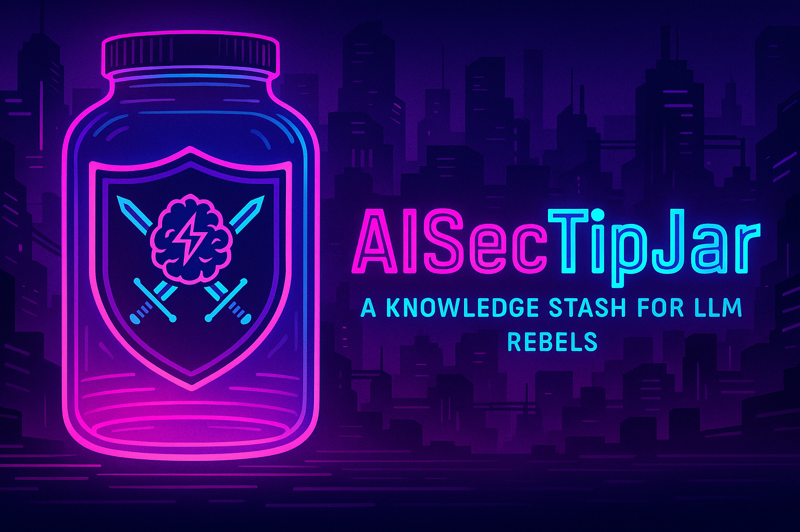

<!--
```
    **********************************************************************************
    *                                                                                *
    *  █████╗ ██╗███████╗███████╗ ██████╗████████╗██╗██████╗     ██╗ █████╗ ██████╗  *
    * ██╔══██╗██║██╔════╝██╔════╝██╔════╝╚══██╔══╝██║██╔══██╗    ██║██╔══██╗██╔══██╗ *
    * ███████║██║███████╗█████╗  ██║        ██║   ██║██████╔╝    ██║███████║██████╔╝ *
    * ██╔══██║██║╚════██║██╔══╝  ██║        ██║   ██║██╔═══╝██   ██║██╔══██║██╔══██╗ *
    * ██║  ██║██║███████║███████╗╚██████╗   ██║   ██║██║    ╚█████╔╝██║  ██║██║  ██║ *
    * ╚═╝  ╚═╝╚═╝╚══════╝╚══════╝ ╚═════╝   ╚═╝   ╚═╝╚═╝     ╚════╝ ╚═╝  ╚═╝╚═╝  ╚═╝ *
    *                                                                                *
    *                                                                                *
    **********************************************************************************                                       
           AISecTipJar – a knowledge stash for LLM rebels & midnight hackers
```
-->
<p align="center">
  
</p>

# AISecTipJar 🔐🤖🛠️

**AI + Security = 🔥**  
Welcome to the vault where I stash bite-sized, technically deep **AI-Security tips & tricks** about for example:

* Adversarial NLP & prompt injection
* RAG data poisoning and retrieval attacks
* Model-Context-Protocol (MCP) security
* Agent-to-Agent (A2A) risk shenanigans
* Inference-time side channels
* Mitigation & hardening research

and of course, not limited with those! 👽

Think hallway-con wisdom distilled into markdown nuggets you can grep at 3 a.m. 🌙  

If you dig it, ⭐ **star** and 📬 **watch** the repo—new tips & tricks appear often! 🌟🚀

Live long, and prosper! 🖖

---

## Quickstart

```bash
git clone https://github.com/nuryslyrt/AISecTips-Tricks.git
cd AISecTipVault
less tips/2025-06-15-rag-poisoning.md  
```

## Index 📚

Current collection of tips & tricks:

| # | Tip                                                                          | Area(s)         |
| - | ---------------------------------------------------------------------------- | --------------- |
| 1 | **[2025-06-15 • RAG Embedding Poisoning](tips/2025-06-15-rag-poisoning.md)** | RAG, Embeddings |


-EOF
