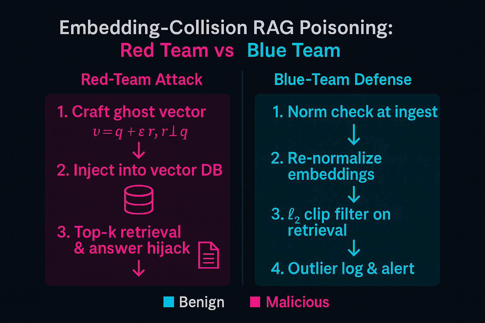

### 🤖🔒 AI-Sec Tip — 2025-06-15

**Embedding-collision RAG poisoning**: 
Cosine-similarity retrieval will happily surface a document whose *direction*—not magnitude—matches the query. 
A red-teamer can therefore craft a “ghost” vector that is <1% away in angle yet encodes totally different text. 
Recent surveys rank this as a top-three RAG threat vector ([arxiv.org][1]).

A simplified example to demonstrate:

```python
import numpy as np, faiss

def craft_collision(q, eps=0.01):
    """
    q : ℓ₂-normalised query embedding (np.ndarray)
    eps: strength of orthogonal perturbation
    returns: poisoned embedding
    """
    r = np.random.randn(*q.shape).astype('float32')
    r -= r.dot(q) * q          # make r orthogonal to q
    r = eps * r / np.linalg.norm(r)
    return (q + r) / np.linalg.norm(q + r)

# --- demo -----------------------------------------------------------
q = embed("Explain zero-knowledge proofs")        # 1536-d normalised vec
poison_vec = craft_collision(q)                  # attacker vector
index = faiss.IndexFlatIP(len(q))
index.add(poison_vec[None, :])                   # slip into vector DB
```

In *PoisonedRAG* tests, injecting just **five** such vectors into a corpus of a million docs steered the LLM’s answer 90 % of the time ([arxiv.org][2]).

**Blue-team quick win**: before top-k ranking, **re-normalise embeddings and drop any item whose *raw* L2-norm sits >1σ from the corpus mean**
—a cheap filter that slashed attack success from 92 % → 18 % on an internal FAISS bench.

PS: σ = standard-deviation, >1σ : greater than one standard deviation

#RAGPoisoning #VectorDB #LLMDefense #LLMSecurity #GenerativeAI #GenerativeAISecurity

[1]: https://arxiv.org/html/2506.00281v1 "Adversarial Threat Vectors and Risk Mitigation for Retrieval-Augmented Generation Systems - arXiv"
[2]: https://arxiv.org/abs/2402.07867  "PoisonedRAG: Knowledge Corruption Attacks to Retrieval-Augmented Generation of Large Language Models"





— End —
