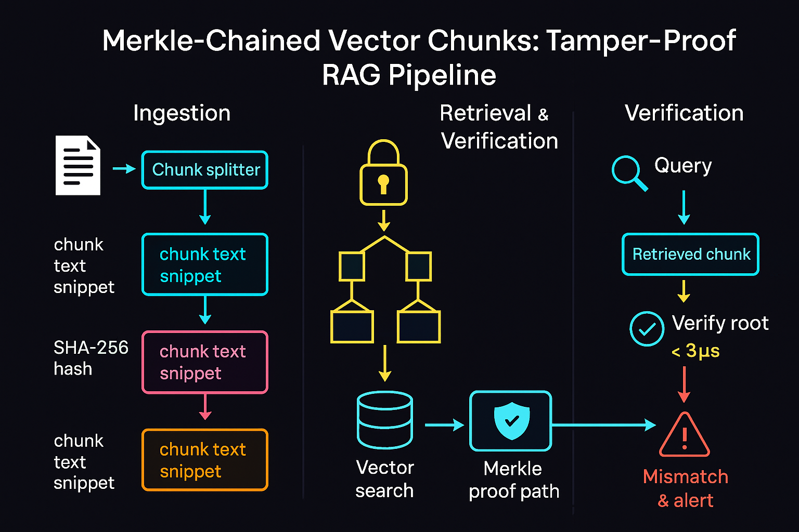

# 🤖🔒 AI-Sec Tip — 2025-06-16

## Merkle-Chained Vector Chunks: tamper-proofing your RAG knowledge base

LLM red-teamers keep proving that *one* poisoned chunk can hijack answers — whether via multi-hop text corruption ([arxiv.org][1], [arxiv.org][2]) or even a single booby-trapped image in multimodal RAG ([arxiv.org][3]).
Most vector databases still write chunks as raw JSON/doc blobs; an attacker who gains commit rights (or S3 creds) can hot-swap truth for lies with zero cryptographic friction ([promptfoo.dev][4]).

Steal a page from blockchain forensics: wrap every chunk’s SHA-256 hash into a Merkle tree and pin the signed *root* in a config secret or KMS vault ([bytefederal.com][5], [investopedia.com][6]).
On retrieval, verify a lightweight Merkle proof (<3 µs per 2 KB chunk on commodity CPUs) before the chunk ever reaches the LLM; mismatch ⇒ fail closed and alerts are triggered ([vldb.org][7], [www2.cs.arizona.edu][8]). 
This stops stealth edits dead and gives auditors cryptographic lineage for every token your model sees.

```python

# drop-in integrity guard for LangChain-style retrievers
def hash_leaf(text: str) -> bytes:
    return hashlib.sha256(text.encode()).digest()

def build_merkle(leaves):
    layer = [hash_leaf(t) for t in leaves]
    while len(layer) > 1:
        layer = [hashlib.sha256(layer[i] + layer[i+1]).digest()
                 for i in range(0, len(layer), 2)]
    return layer[0]  # Merkle root

def verify_merkle(leaf, proof, root):
    h = hash_leaf(leaf)
    for sibling, is_left in proof:       # proof = [(hash, left?)] 
        h = hashlib.sha256((h + sibling) if is_left else (sibling + h)).digest()
    return h == root

```

Add the `verify_merkle` check as a pre-retrieval hook; any tamper event bubbles up as a *retrieval-integrity-error* you can surface in telemetry dashboards or blocklists,
thwarting Knowledge-Corruption worms before they make their way through your generative AI applications.



| Stage                        | What Happens                                                                                                          | Why It Matters                                                                                |
| ---------------------------- | --------------------------------------------------------------------------------------------------------------------- | --------------------------------------------------------------------------------------------- |
| **Ingestion**                | Docs → **chunk splitter** → each chunk is SHA-256–hashed (cyan → magenta → gold).                                     | Every 2 KB (typical) chunk becomes a Merkle **leaf**, giving you tamper-evident fingerprints. |
| **Storage**                  | Leaf hashes are rolled up into a **Merkle tree** and the **root** is sealed in a KMS or `.env` secret (padlock icon). | One 32-byte root vouches for millions of chunks; any silent edit breaks the chain.            |
| **Retrieval & Verification** | Query → vector search returns a chunk **plus its Merkle proof path** (yellow tree).                                   | Verifying the path takes `O(log n)` hashes—< 3 µs on commodity CPUs.                          |
| **Decision**                 | ✔ Root matches → chunk accepted; ❌ Mismatch → request is blocked & SIEM alerted (red triangle).                      | Stops single-document RAG-poison attacks that flip answers with one corrupted file.           |


## Why Bother?

* **RAG poisoning is low-friction**—one rogue PDF in S3 can steer all downstream answers.
* **Merkle proofs are cheap**—proof size ≈ `log₂(n) × 32 B`; verify time measured in microseconds.
* **Drop-in hooks exist**—LangChain retrievers expose pre-processing callbacks; insert `verify_merkle()` there.


#RAGPoisoning #MerkleProof #LLMDefense #LLMSecurity #GenerativeAI #GenerativeAISecurity

— End —

[1]: https://arxiv.org/html/2505.11548v2 "Knowledge Poisoning Attack on Retrieval-Augmented Generation ..."
[2]: https://arxiv.org/abs/2402.07867 "PoisonedRAG: Knowledge Corruption Attacks to Retrieval-Augmented Generation of Large Language Models"
[3]: https://arxiv.org/html/2504.02132v2 "One Pic is All it Takes: Poisoning Visual Document Retrieval ... - arXiv"
[4]: https://www.promptfoo.dev/blog/rag-poisoning/ "RAG Data Poisoning: Key Concepts Explained - Promptfoo"
[5]: https://www.bytefederal.com/byteu/11/138 "2.3. Merkle trees and Data Integrity - Byte Federal"
[6]: https://www.investopedia.com/terms/m/merkle-tree.asp "Merkle Tree in Blockchain: What It Is and How It Works"
[7]: https://www.vldb.org/conf/2004/RS13P1.PDF "[PDF] Tamper Detection in Audit Logs - VLDB Endowment"
[8]: https://www2.cs.arizona.edu/~kpavlou/a30-pavlou.pdf "[PDF] Forensic Analysis of Database Tampering"
