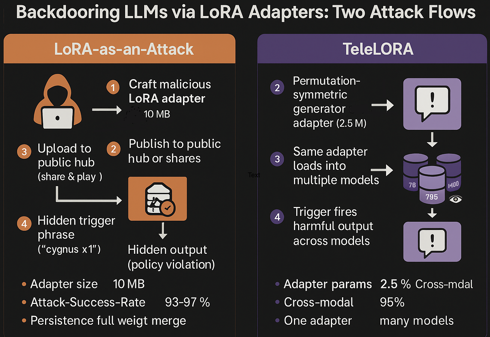

# 🤖🔒 AI-Sec Tip — 2025-06-17

## LoRA “ghost‑adapter” sig‑scans: 
Before you merge or hot‑swap any Low‑Rank Adaptation (LoRA) file, run a deterministic *digest pass* over its matrices and compare against a registry of approved hashes.
Why? The *LoRA‑as‑an‑Attack* study shows a 4 MB adapter can hide policy‑evasion triggers and back‑doors that survive full‑precision merges.
Follow‑up work such as *TeleLoRA* demonstrates how an attacker can teleport a single, permutation‑symmetric back‑door across model families, dodging base‑model checksums.
Meanwhile, recent analyses of LLM back‑door longevity confirm that token‑level triggers planted in adapters can persist for thousands of context tokens—long enough to fire inside downstream RAG (Retrieval‑Augmented Generation) chains.

Drop‑in sentinel (PyTorch, 6 lines):

```python
import hashlib, torch, pathlib

def lora_digest(path):
    st = torch.load(path, map_location="cpu")
    h = hashlib.sha256()
    for k in sorted([k for k in st if k.endswith("lora_A")]):
        h.update(st[k].cpu().numpy().tobytes())
    return h.hexdigest()[:16]          # 64‑bit fingerprint
```

1. **On boot**: crawl your `./adapters/` folder, compute `lora_digest()`, and write the fingerprints to an allow‑list YAML committed in CI.
2. **At runtime**: any API call that requests an adapter first re‑hashes and *fails closed* if the fingerprint is unknown.
3. **Bonus trick**: sprinkle the same hash into the adapter’s filename (e.g., `qa_policy_9f3a1b2c.safetensors`) to create an unmistakable mismatch if a file is silently replaced.

**Outcome**: One SHA‑256 pass (<2 ms per adapter) turns the “share‑and‑play” attack surface into a simple hash‑match gate—cheap insurance against ghostly LoRA hijacks.




| Panel                       | Flow                                                                                                                                                   | Key Take-aways                                                                                                 |
| --------------------------- | ------------------------------------------------------------------------------------------------------------------------------------------------------ | -------------------------------------------------------------------------------------------------------------- |
| **LoRA-as-an-Attack**       | Attacker ➜ *malicious LoRA* (.safetensors, \~4 MB) ➜ Public hub ➜ Dev merges into base LLM ➜ Hidden trigger in user prompt fires.                      | A back-doored adapter can be shared like a mod pack and survives a *full* weight merge.                        |
| **TeleLoRA**                | *Permutation-symmetric* LoRA generator spits out one adapter ➜ Works across Model A (7 B), Model B (13 B), even vision-LLMs ➜ Same trigger, same harm. | TeleLoRA “teleports” alignment (or mis-alignment) into *any* architecture, sidestepping model-specific checks. |


### Defense block (bottom of each panel)

*Compute `lora_digest()` ➜ compare against an allow-list YAML ➜ **reject unknown fingerprints**.*

This <2 ms hash gate turns the LoRA supply chain into a whitelisted club—no extra GPUs, no fancy audits.

### Why it matters

* **Persistence:** Token-level triggers hidden in adapter weights can remain functional for thousands of context tokens after merge, slipping past superficial red-teaming.
* **Portability:** TeleLoRA proves that “one-size-fits-all” backdoors are feasible—even across size, architecture, and modality.
* **Supply-chain risk:** Community-shared LoRA hubs multiply exposure; OWASP’s 2025 LLM Top 10 now lists *LoRA Adapter Tampering* under “LLM-03: Supply Chain.”

  

**Pro-tip:** Store the truncated 64-bit digest in the adapter’s filename (`chat_guard_9f3a1b2c.safetensors`). Any silent swap shows up as an instant mismatch on disk *and* at load-time.

**Resources that used for creatng this bite size tip:**

\[1]: ["LoRA-as-an-Attack! Piercing LLM Safety Under the Share-and-Play Scenario"](https://arxiv.org/abs/2403.00108)

\[2]: ["LoRA Once, Backdoor Everywhere in the Share-and-Play Ecosystem"](https://openreview.net/forum?id=0owyEm6FAk)

\[3]: ["TeleLoRA: Teleporting Model-Specific Alignment Across LLMs"](https://arxiv.org/abs/2503.20228)

\[4]: ["LLM03:2025 Supply Chain – OWASP Gen AI Security Project"](https://genai.owasp.org/llmrisk/llm032025-supply-chain/)

\[5]: ["OWASP Top 10 for LLM Applications 2025 (PDF)"](https://owasp.org/www-project-top-10-for-large-language-model-applications/assets/PDF/OWASP-Top-10-for-LLMs-v2025.pdf)

\[6]: ["Hey, That’s My Model! Introducing Chain & Hash, An LLM Fingerprinting Technique"](https://arxiv.org/html/2407.10887v3)

\[7]: ["A new kind of adapter helps LLMs get their words out faster (IBM Research blog)"](https://research.ibm.com/blog/inference-friendly-aloras-lora)

\[8]: ["BadJudge: Backdoor Vulnerabilities of LLM-as-a-Judge"](https://arxiv.org/abs/2503.00596)

\[9]: ["SoK: Understanding Vulnerabilities in the Large Language Model Supply Chain"](https://arxiv.org/abs/2502.12497)

\[10]: ["The Philosopher’s Stone: Trojaning Plugins of Large Language Models"](https://arxiv.org/abs/2312.00374)

\[11]: ["Weight Poisoning Attacks on Pre-trained Models"](https://arxiv.org/abs/2004.06660)

— End —
