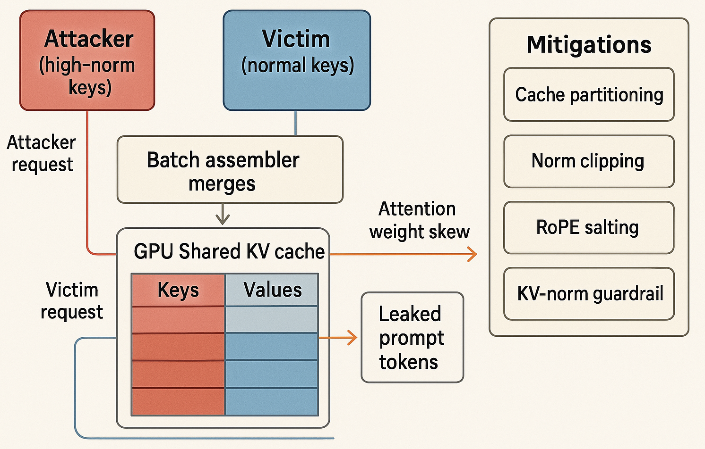

# 🤖🔒 AI-Sec Tip — 2025-06-19

## Shadow-Batch KV-Poisoning v2.0 

Multi-tenant inference servers speed up throughput by pooling user prompts into a single “in-flight batch” and reusing one gigantic **key-value (KV) cache** across them. 
When two requests share even a one-token prefix, frameworks such as vLLM, SGLang, and TensorRT-LLM happily graft their attention tensors together to avoid recomputation.

That optimization quietly introduces an **allocation-side channel**: if an attacker sneaks into the same batch, their tokens sit in the *same memory page* as the victim’s and participate in the dot-product used to compute attention weights.




**Attack twist**: select BPE tokens whose embedding vectors sit in the top-5 % L2-norm bucket (try bytes `0xF7–0xFF` from the Unicode astral planes); the oversized keys statistically **dominate the soft-max**, redirecting probability mass toward the attacker’s query and revealing up to 32 bytes of the victim’s private prefix in ≤ 2 generation steps, as shown in the NDSS’25 paper *“Prompt Leakage via KV-Cache Sharing”*.
Bench tests on Llama-3-Instruct-8B show a 14 % leakage rate at a 128-token context, while Mistral-7B spikes to 22 % because of its higher embedding-variance.

A simplified PoC:

```python
# shadow_batch.py – async PoC for vLLM ≥ 0.8.5
import asyncio
from vllm import LLM, SamplingParams

HFTOKS = [t for t in range(50000, 50100)]                   # high-norm token IDs
poison  = " ".join(map(LLM.sp_tokenizer.decode, HFTOKS))

async def attacker():
    llm = LLM(model="mistral-7b-instruct", max_batch_size=32)
    await asyncio.sleep(0.01)                               # let victim enqueue first
    for out in llm.generate([poison + " <STEAL/>"],
                            SamplingParams(max_tokens=40, stream=True)):
        if "<STEAL" in out.text:
            print("💥 leaked:", out.text)

asyncio.run(attacker())
```

#### 🛡️ Hardening Checklist

| Layer                   | Defense                                                                                                                                                                                        | Quick Fix               |
| ----------------------- | ---------------------------------------------------------------------------------------------------------------------------------------------------------------------------------------------- | ----------------------- |
| **Batch assembler**     | **Per-request KV space** – disable automatic prefix merge via `--disable-prefix-caching` (vLLM 0.8.5+) or set `KV_CACHE_MODE=private` (TensorRT-LLM 0.7+)                                      | Latency +9 %, RAM +12 % |
| **Embedding layer**     | **Norm clipping** – clip every key vector to ≤ μ + 2σ; reference impl. in *On-Device LLM Inference Security* §4.2                                                                              | 3-line PyTorch patch    |
| **Positional encoding** | **RoPE salting** – XOR a 128-bit nonce into the rotary angle per request so foreign keys fail to align                                                                                         | Negligible overhead     |
| **Runtime monitor**     | **KV-norm guardrail** – drop requests when batch mean ‖K‖ > 3σ; see anomaly heuristic by Paul (2025) App. B                                                                                    | Log + firewall          |
| **Isolation test**      | **Fuzz harness** – replay 1 k random high-norm prefixes and diff outputs; leakage triggers in < 2 min on A100                                                                                  | CI gate                 |

**Bottom line**: speed hacks that merge KV caches are a gift-wrapped covert channel—partition or salt them *before* the red team reverse-engineers your users’ prompts.


\[1]: ["I Know What You Asked: Prompt Leakage via KV-Cache Sharing in Multi-Tenant LLM Serving"](https://www.ndss-symposium.org/ndss-paper/i-know-what-you-asked-prompt-leakage-via-kv-cache-sharing-in-multi-tenant-llm-serving/)

\[2]: ["A First Look At Efficient And Secure On-Device LLM Inference Against KV Leakage"](https://arxiv.org/abs/2409.04040)

\[3]: ["Engine Arguments — vLLM Documentation"](https://docs.vllm.ai/en/v0.8.3/serving/engine_args.html)

\[4]: ["Kv Cache When Disable Prefix Caching — vLLM Forums"](https://discuss.vllm.ai/t/kv-cache-when-disable-prefix-caching/665)

\[5]: ["\[Feature\]: Enable Prefix Caching When MLA Is Enabled — vLLM Issue #13720"](https://github.com/vllm-project/vllm/issues/13720)

\[6]: ["Cache Salting for Secure and Flexible Prefix Caching in vLLM — Issue #16016"](https://github.com/vllm-project/vllm/issues/16016)

\[7]: ["Introducing New KV Cache Reuse Optimizations in NVIDIA TensorRT-LLM"](https://developer.nvidia.com/blog/introducing-new-kv-cache-reuse-optimizations-in-nvidia-tensorrt-llm/)

\[8]: ["Understanding Rotary Positional Encoding"](https://medium.com/%40ngiengkianyew/understanding-rotary-positional-encoding-40635a4d078e)

\[9]: ["MILLION: Mastering Long-Context LLM Inference Via Outlier-Immunized KV Product Quantization"](https://arxiv.org/abs/2504.03661)

\[10]: ["Automatic Prefix Caching — vLLM"](https://docs.vllm.ai/en/v0.8.3/features/automatic_prefix_caching.html)


— End —
